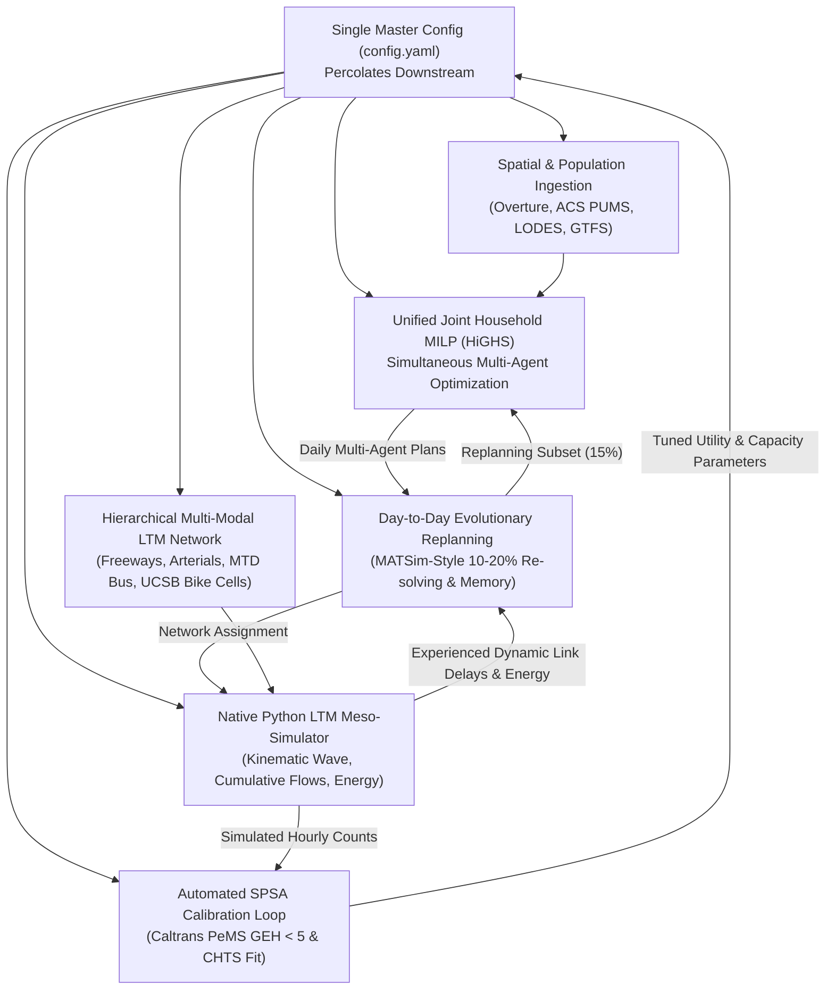

# NextGen ABM: Santa Barbara County

> **Next-Generation Activity-Based Travel Demand Model** grounded in the *"From Trips to Lives"* paradigm by **Prof. Jinhua Zhao** (MIT) and **Prof. Michel Bierlaire** (EPFL / Swiss Federal Railways SBB).

[](https://www.python.org/)
[](https://opensource.org/licenses/MIT)
[](https://overturemaps.org/)

---

## Overview

Traditional 4-step and legacy Activity-Based Models (ABMs) suffer from artificial decision hierarchies (mandatory -> tour -> mode -> departure), synthetic cross-sectional populations without historical memory, and decoupled individuals where vehicles appear out of thin air.

**NextGen ABM** completely rebuilds the travel demand architecture for **Santa Barbara County, California** using 100% open data and 100% open-source software:
- **Building-Footprint Resolution**: Ingests ~140,000 Santa Barbara County building footprints and POIs directly from Overture Maps GeoParquet via DuckDB.
- **Dynamic Multi-Year Life Histories**: Simulates persistent synthetic agents over time with stochastic demographic and career transitions (Prior + Update Bayesian framework).
- **Dedicated UCSB & Isla Vista Sub-Model**: Models 26,000+ students, high-occupancy roommate housing, Registrar course timetable micro-peaks, Class-I bike networks, and fare-free Santa Barbara MTD bus transit.
- **Unified Joint Household MILP**: Solves a simultaneous mathematical program in HiGHS (`highspy`) enforcing strict physical vehicle space-time mutual exclusion and school escort chains in under 50ms.
- **Native In-Memory Python Meso-Simulator**: Implements the Link Transmission Model (LTM) based on Kinematic Wave Theory (triangular fundamental diagrams, sending/receiving cumulative flows, physical queue spillback, and EV battery draw).
- **Day-to-Day Evolutionary Replanning**: MATSim-style evolutionary supply-demand feedback loop with plan memory, scoring, logit selection, and 15% replanning rate.
- **Automated SPSA Calibration**: Simultaneous Perturbation Stochastic Approximation actively tuning behavioral parameters and corridor capacities against Caltrans PeMS freeway sensors (GEH < 5) and CHTS survey distributions.
- **Policy Evaluator**: Evaluates US-101 peak spreading, clock-face Pacific Surfliner regional rail, UCSB staggered lectures, and EV grid load shifting.

---

## Architecture



---

## Directory Structure

```text
nextgen_abm/
├── config.yaml                    # Master declarative configuration
├── pyproject.toml                 # Dependencies and build configuration
├── src/nextgen_abm/
│   ├── config.py                  # Pydantic master config schemas & loader
│   ├── spatial/
│   │   ├── overture.py            # DuckDB Overture GeoParquet queries (S3)
│   │   ├── capacity.py            # Parcel land-use join & building capacity
│   │   ├── places.py              # POI classification & opening windows
│   │   ├── routing.py             # Multi-scale router & USGS 3DEP elevation
│   │   └── gtfs.py                # Regional GTFS (MTD, Surfliner, Clean Air)
│   ├── population/
│   │   ├── census.py              # ACS PUMS microdata & marginal synthesizer
│   │   ├── lodes.py               # LEHD LODES block-level job anchoring
│   │   ├── life_history.py        # Annual life-event transition hazard models
│   │   └── ucsb.py                # UCSB student cohorts, timetable & bike paths
│   ├── scheduler/
│   │   ├── pruning.py             # Space-time opportunity ellipse pruning
│   │   ├── milp.py                # Single-agent 24h continuous HiGHS MILP
│   │   └── sampling.py            # Metropolis-Hastings MCMC choice sampler
│   ├── household/
│   │   ├── assets.py              # Physical space-time vehicle conservation
│   │   ├── ev.py                  # EV battery SoC tracker & charging windows
│   │   ├── escort.py              # School escort chain coordination
│   │   ├── household_milp.py      # Unified Joint Household MILP solver
│   │   └── beam_export.py         # MATSim plans & BEAM vehicle exporter
│   ├── traffic/
│   │   ├── network.py             # Hierarchical multi-modal network graph
│   │   ├── ltm.py                 # Native Python Kinematic Wave LTM simulator
│   │   └── equilibrium.py         # Day-to-Day evolutionary replanning engine
│   ├── policy/
│   │   └── scenarios.py           # US-101, Surfliner, UCSB, & EV scenarios
│   └── validation/
│       ├── calibration.py         # CHTS activity duration calibration
│       ├── traffic_validation.py  # Caltrans PeMS GEH validation
│       ├── spsa_calibration.py    # Automated SPSA parameter tuning loop
│       └── dashboard.py           # 3D interactive PyDeck dashboard
├── tests/                         # 40 comprehensive unit & integration tests
└── openspec/                      # Specification-driven development archive
    ├── specs/                     # Permanent capability specifications
    └── changes/archive/           # Archived change proposals & task histories
```

---

## Installation & Quickstart

### Prerequisites
- Python >= 3.10 (tested on Python 3.12)
- [uv](https://github.com/astral-sh/uv) (recommended) or `pip`

```bash
# Clone the repository
git clone https://github.com/rskris/nextgen_abm.git
cd nextgen_abm

# Create virtual environment and install dependencies
uv venv
source .venv/bin/activate
uv pip install -e ".[dev]"
```

### Running Tests
Execute the full test suite (43 unit & integration tests pass in ~2s):
```bash
pytest -v
```

### Command-Line Interface (CLI)

```bash
# 1. Sync and cache Santa Barbara open data (Overture GeoParquet, Census PUMS, LEHD LODES, GTFS)
nextgen-abm sync-data

# 2. Run end-to-end parallel simulation (sample rate, iterations, and CPU workers)
nextgen-abm run --sample 0.1 --iterations 3 --workers 12 --output-dir outputs

# 3. Run automated SPSA calibration against Caltrans PeMS freeway detectors
nextgen-abm calibrate --iterations 5

# 4. Render interactive 3D PyDeck dashboard
nextgen-abm dashboard --output-dir outputs
```


### Python API Example: Joint Household Optimization & Traffic Simulation

```python
from nextgen_abm.config import get_config
from nextgen_abm.household.household_milp import UnifiedHouseholdMILP, MemberAgenda
from nextgen_abm.household.assets import VehicleAsset
from nextgen_abm.scheduler.milp import ActivityDefinition
from nextgen_abm.traffic.network import HierarchicalMultiModalNetwork
from nextgen_abm.traffic.equilibrium import DayToDayEquilibriumEngine, HouseholdAgent

# 1. Load Santa Barbara County multi-modal network
config = get_config()
network = HierarchicalMultiModalNetwork.build_santa_barbara_regional_network(config)

# 2. Build multi-agent household with shared EV
solver = UnifiedHouseholdMILP(config=config)
home_loc = [("bldg_home", (-119.82, 34.43))]
work_loc = [("bldg_work", (-119.70, 34.42))]

member = MemberAgenda(
    person_id="p1",
    is_adult=True,
    has_license=True,
    activities=[
        ActivityDefinition("h1", "home_morning", True, home_loc, 0.5, 3.0, 6.0, 9.0),
        ActivityDefinition("w", "work", True, work_loc, 6.0, 9.0, 8.0, 18.0),
        ActivityDefinition("h2", "home_night", True, home_loc, 4.0, 10.0, 17.0, 24.0),
    ],
)
household = HouseholdAgent(
    household_id="hh_01",
    members=[member],
    vehicles=[VehicleAsset("ev_01", "hh_01", "ev", "bldg_home", "bldg_home")],
)

# 3. Run Day-to-Day evolutionary replanning simulation
engine = DayToDayEquilibriumEngine(network=network, config=config)
metrics = engine.run_equilibrium(households=[household], max_iterations=3)

for m in metrics:
    print(f"Iteration {m.iteration}: VHT={m.total_vht_hours:.2f}h, Gap={m.relative_gap:.4f}")
```

---

## 100% Open Data Sources

| Data Asset | Agency / Provider | Spatial Resolution | Usage in Model |
| :--- | :--- | :--- | :--- |
| **Overture Maps** | Overture Maps Foundation | Building Footprints (~140k) & POIs | Parcel capacities, destination choice |
| **ACS PUMS** | US Census Bureau | PUMA (08301, 08302) & Block Groups | Household & person demographic synthesis |
| **LEHD LODES** | US Census Bureau | Census Blocks | Workplace location choice & worker flows |
| **GTFS Schedules** | SBMTD, Clean Air Express, Amtrak | Transit Stops & Timetables | Transit route travel time skims & fares |
| **3DEP Elevation** | USGS | 10-meter DEM | Active mode slope impedance & EV physics |
| **PeMS Sensors** | Caltrans District 5 | Highway Detectors (US-101) | SPSA traffic flow validation (GEH < 5) |

---

## License

This project is licensed under the [MIT License](LICENSE).
