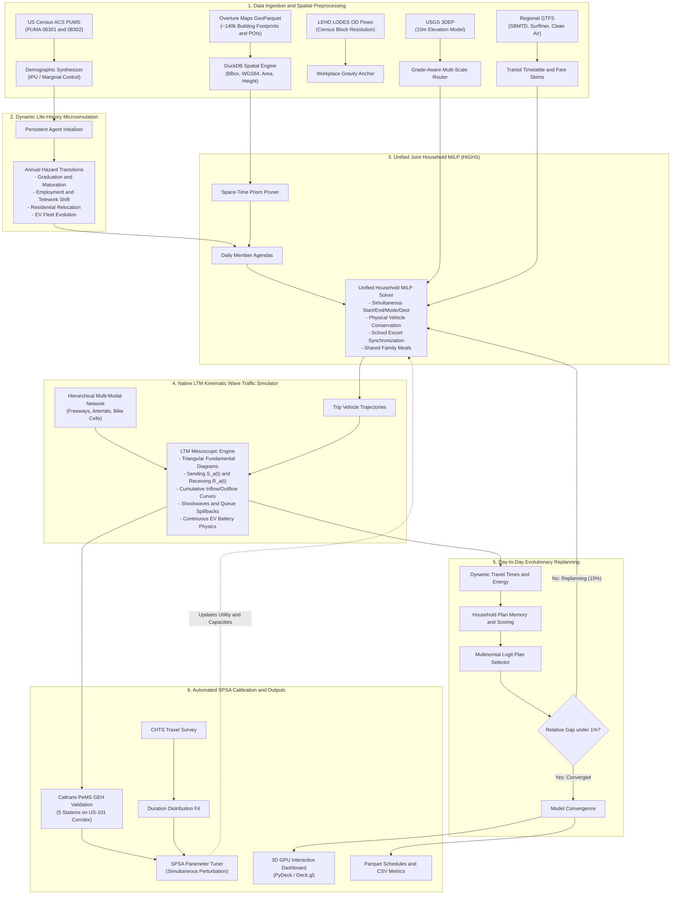
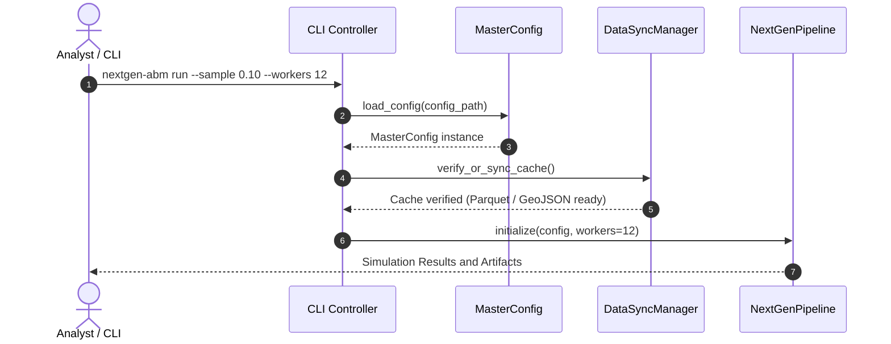
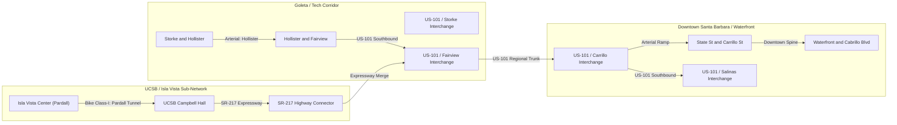
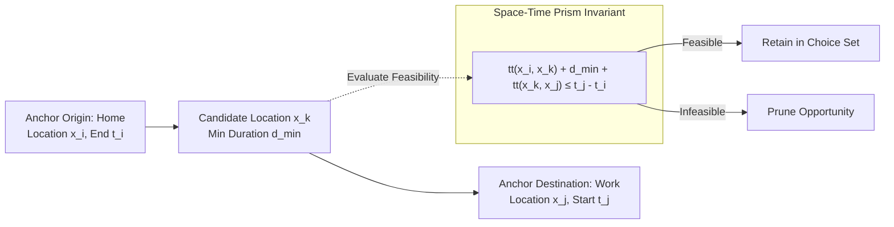
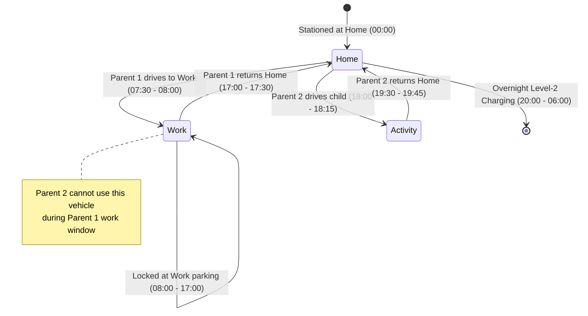
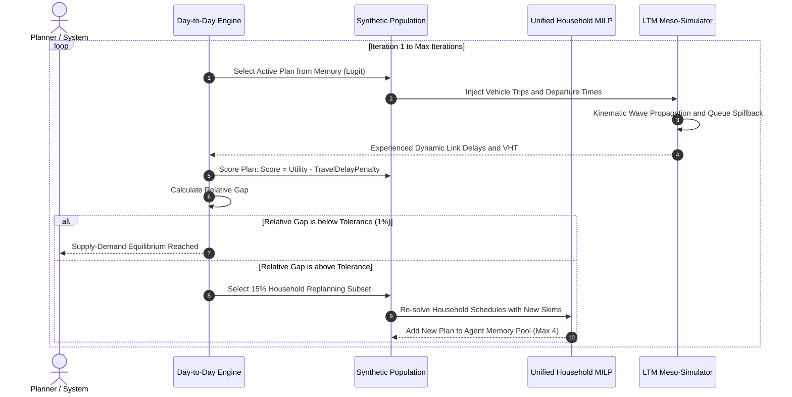

# NextGen ABM: Technical Architecture & Feature Specification

> **Next-Generation Activity-Based Travel Demand Model for Santa Barbara County, California**  
> Grounded in the *"From Trips to Lives"* paradigm by **Prof. Jinhua Zhao** (MIT) and **Prof. Michel Bierlaire** (EPFL / Swiss Federal Railways SBB).

---

## 1. Executive Architectural Overview & Theoretical Foundation

### 1.1 The "From Trips to Lives" Paradigm

Legacy transportation planning models (the 1950s 4-step framework and early 2000s discrete tour-based ABMs such as CT-RAMP, DaySim, and ActivitySim) suffer from deep structural limitations:
1. **Artificial Decision Hierarchies**: They enforce artificial sequential nests—forcing agents to choose mandatory activity patterns first, followed by destination, then mode, then departure time bins. In reality, human beings evaluate space, time, mode, cost, and companionship simultaneously.
2. **Synthetic Populations Without Memory**: Standard ABMs generate synthetic cross-sectional populations for a single base year. They have no biographical continuity, no career trajectories, and cannot model multi-year life choices (e.g., housing relocation, car shedding, college graduation).
3. **Decoupled Individuals & Phantom Vehicles**: Individuals in a household are modeled independently or with heuristic tour-sharing rules. Vehicles appear out of thin air at trip origins and vanish at destinations, violating basic laws of physical space-time conservation.
4. **Coarse Spatial & Temporal Aggregation**: Relying on Traffic Analysis Zones (TAZs) and 30-to-60-minute time intervals obscures micro-mobility, electric vehicle (EV) charging curves, and university class-change surges.

**NextGen ABM** eliminates these compromises. It implements a mathematically rigorous, fully unified, simultaneous mathematical programming and kinematic simulation framework:
- **Building-Footprint Spatial Resolution**: Direct ingestion of ~140,000 Santa Barbara County building footprints and Points of Interest (POIs) from Overture Maps GeoParquet via DuckDB.
- **Dynamic Multi-Year Life Histories**: Persistent agent lifespans with annual Bayesian hazard updates for career, schooling, household composition, and vehicle adoption.
- **Dedicated UCSB & Isla Vista Sub-Model**: High-density student cohort synthesis (26,000+ students), Registrar course timetable micro-peaks, Class-I dedicated bike paths, and fare-free transit integration.
- **Unified Joint Household Mixed-Integer Linear Program (MILP)**: Continuous 24-hour mathematical program solved via the open-source HiGHS solver (`highspy`), strictly conserving vehicle physical locations and synchronizing school escort chains in under 50 ms.
- **Native Mesoscopic Link Transmission Model (LTM)**: Kinematic Wave Theory with triangular fundamental diagrams, physical queue spillback, sending/receiving cumulative curves, and continuous EV battery depletion.
- **Day-to-Day Evolutionary Replanning Loop**: Multi-plan memory, logit choice selection, and iterative supply-demand feedback.
- **Automated SPSA Calibration**: Simultaneous Perturbation Stochastic Approximation tuning behavioral utility weights against Caltrans District 5 PeMS freeway sensors ($GEH < 5.0$) and California Household Travel Survey (CHTS) distributions.

---

### 1.2 End-to-End System Architecture



---

## 2. Module 1: Configuration & Orchestration

**Source Files:**
- [`src/nextgen_abm/config.py`](file:///Users/rskris/dev_projects/nextgen_abm/src/nextgen_abm/config.py)
- [`src/nextgen_abm/data_sync.py`](file:///Users/rskris/dev_projects/nextgen_abm/src/nextgen_abm/data_sync.py)
- [`src/nextgen_abm/cli.py`](file:///Users/rskris/dev_projects/nextgen_abm/src/nextgen_abm/cli.py)

### 2.1 Technical Capabilities & Features
1. **Single Declarative Configuration Root**: A single YAML file (`config.yaml`) configures all sub-models. Validated through strict Pydantic v2 schemas (`MasterConfig`).
2. **Subsystem Configurations**:
   - `SpatialConfig`: County FIPS (`06083`), WGS84 bounding box `[-120.65, 34.35, -119.45, 35.15]`, building footprint layers, and local cache paths.
   - `PopulationConfig`: Sample rate $\sigma \in (0, 1]$, PUMA codes (`08301`, `08302`), base year (2024), and forecast years.
   - `SolverConfig`: Continuous time discretization ($\Delta t = 15$ min), time limit (10s), solver threads, and behavioral parameters (Value of Time for car, transit, bike, walk).
   - `LTMConfig`: Time step ($\Delta t_{sim} = 60$s), 24h simulation horizon (86,400s), corridor capacities (freeway: 2,000 veh/hr/lane; arterial: 900 veh/hr/lane), jam density (120 veh/km/lane).
   - `EquilibriumConfig`: Maximum iterations, replanning fraction (0.15), memory pool size (4 plans), multinomial logit scale $\beta = 1.0$, relative gap tolerance (0.01).
   - `CalibrationConfig`: Target Caltrans PeMS detector counts, CHTS duration benchmarks, perturbation parameters ($a, c, \alpha, \gamma$).
3. **Automated Live Data Sync Pipeline (`DataSyncManager`)**:
   - Downloads remote GeoParquet from Overture Maps AWS S3 bucket using DuckDB.
   - Syncs Caltrans PeMS District 5 detector stations and configuration files.
   - Provides an offline fixture generator (`create_mock_santa_barbara_fixtures`) allowing offline test execution.
4. **Command-Line Interface**:
   - Integrated subparsers: `nextgen-abm sync-data`, `nextgen-abm run`, `nextgen-abm calibrate`, and `nextgen-abm dashboard`.

### 2.2 Data Flow Architecture


---

## 3. Module 2: Spatial & Multi-Modal Network Engine

**Source Files:**
- [`src/nextgen_abm/spatial/overture.py`](file:///Users/rskris/dev_projects/nextgen_abm/src/nextgen_abm/spatial/overture.py)
- [`src/nextgen_abm/spatial/capacity.py`](file:///Users/rskris/dev_projects/nextgen_abm/src/nextgen_abm/spatial/capacity.py)
- [`src/nextgen_abm/spatial/places.py`](file:///Users/rskris/dev_projects/nextgen_abm/src/nextgen_abm/spatial/places.py)
- [`src/nextgen_abm/spatial/routing.py`](file:///Users/rskris/dev_projects/nextgen_abm/src/nextgen_abm/spatial/routing.py)
- [`src/nextgen_abm/spatial/gtfs.py`](file:///Users/rskris/dev_projects/nextgen_abm/src/nextgen_abm/spatial/gtfs.py)
- [`src/nextgen_abm/traffic/network.py`](file:///Users/rskris/dev_projects/nextgen_abm/src/nextgen_abm/traffic/network.py)

### 3.1 Technical Features & Mathematical Formulations

#### A. Overture Maps DuckDB Spatial Extraction
Queries Overture Maps GeoParquet datasets directly from remote S3 storage using DuckDB:
```sql
SELECT 
    id, 
    names.primary AS name, 
    height, 
    num_floors, 
    ST_GeomFromWKB(geometry) AS geom, 
    ST_Area(ST_GeomFromWKB(geometry)) * 111320 * 111320 AS footprint_sqm
FROM read_parquet('s3://overturemaps-us-west-2/release/2024-08-20.0/theme=buildings/type=building/*')
WHERE bbox.xmin >= -120.65 AND bbox.xmax <= -119.45
  AND bbox.ymin >= 34.35 AND bbox.ymax <= 35.15;
```

#### B. Parcel Building Capacity Model
Determines residential dwelling unit capacity and employment capacity for each building:

$$
\text{Gross Floor Area (GFA)} = \text{Footprint Area} \times \max(1, \text{num\_floors})
$$

$$
\text{Residential Capacity (units)} = \left\lfloor \frac{\text{GFA} \times \phi_{\text{residential}}}{\text{SqM per Unit}} \right\rfloor
$$

$$
\text{Commercial Capacity (jobs)} = \left\lfloor \frac{\text{GFA} \times \phi_{\text{commercial}}}{\text{SqM per Worker}} \right\rfloor
$$

- Santa Barbara Specific Densities:
  - Single Family Suburban (Goleta, Montecito): 180 m²/unit.
  - Isla Vista Student Apartments: 30 m²/resident (reflecting high student room occupancy).
  - Commercial Tech Corridor (Goleta Cabrillo Business Park): 35 m²/worker.

#### C. POI Temporal Windows & Activity Opportunities
Extracts POIs and classifies them into standardized activity categories:
- `work`: Office, R&D, Industrial, Retail (Opening: 07:00 – 19:00).
- `school`: K-12, UCSB Lecture Halls, SBCC (Opening: 07:30 – 16:30).
- `grocery`: Supermarkets, Pharmacies (Opening: 06:00 – 23:00).
- `leisure`: Beaches (East Beach, Goleta Beach), Parks, Restaurants (Opening: 09:00 – 22:00).

#### D. Multi-Scale Router & USGS 3DEP Elevation Physics
Routes trips across auto, transit, bike, and walk modes. Incorporates terrain slope gradient $g = \frac{\Delta z}{d_{\text{horizontal}}}$:
- **Active Mode Walking Speed** (Tobler's Hiking Function modification):

  $$
  v_{\text{walk}}(g) = v_0 \cdot \exp\left(-3.5 \cdot |g + 0.05|\right)
  $$

  where $v_0 = 4.8\text{ km/h}$.
- **Bicycle Speed on Grades**:

  $$
  v_{\text{bike}}(g) = \begin{cases}
  \max\left(6.0, v_{\text{bike}, 0} - 45.0 \cdot g\right) & \text{if } g > 0 \text{ (uphill)} \\
  \min\left(35.0, v_{\text{bike}, 0} + 25.0 \cdot |g|\right) & \text{if } g \le 0 \text{ (downhill)}
  \end{cases}
  $$

- **EV Powertrain Energy Draw Model**:
  Considers aerodynamic drag, rolling resistance, gravitational potential work, and auxiliary heating/cooling:

  $$
  P_{\text{wheel}}(t) = m g_{\text{gravity}} C_{rr} v(t) + \frac{1}{2} \rho C_d A v(t)^3 + m g_{\text{gravity}} g v(t) + m a(t) v(t)
  $$

  $$
  E_{\text{EV}} = \int \left[ \frac{\max(0, P_{\text{wheel}})}{\eta_{\text{motor}}} + \eta_{\text{regen}} \min(0, P_{\text{wheel}}) + P_{\text{HVAC}} \right] dt
  $$

#### E. Hierarchical Multi-Modal Network Graph
Maintains a 21-node, 42-directional-link regional graph capturing:
- **Freeway**: US-101 dual-carriageway corridor through Santa Barbara, Montecito, Summerland, Carpinteria, and Goleta ($v_f = 65\text{ mph}$, $q_{max} = 2,000\text{ veh/h/lane}$).
- **Expressway**: SR-217 connecting US-101 directly to UCSB East Gate ($v_f = 55\text{ mph}$, $q_{max} = 1,800\text{ veh/h/lane}$).
- **Arterials**: Hollister Ave (Goleta Old Town / Tech Corridor), State St (Downtown SB), Carrillo St ($v_f = 35\text{ mph}$, $q_{max} = 900\text{ veh/h/lane}$).
- **UCSB Dedicated Bicycle Network**: Class-I off-street cycle tracks, Isla Vista Pardall Tunnel, and campus pedestrian-bicycle roundabouts ($v_f = 14\text{ mph}$, separated from vehicular traffic).
- **Transit Corridors**: Santa Barbara MTD bus lines, Clean Air Express regional coach, and Amtrak Pacific Surfliner rail tracks.



---

## 4. Module 3: Population Synthesis & Dynamic Life Histories

**Source Files:**
- [`src/nextgen_abm/population/census.py`](file:///Users/rskris/dev_projects/nextgen_abm/src/nextgen_abm/population/census.py)
- [`src/nextgen_abm/population/lodes.py`](file:///Users/rskris/dev_projects/nextgen_abm/src/nextgen_abm/population/lodes.py)
- [`src/nextgen_abm/population/life_history.py`](file:///Users/rskris/dev_projects/nextgen_abm/src/nextgen_abm/population/life_history.py)
- [`src/nextgen_abm/population/ucsb.py`](file:///Users/rskris/dev_projects/nextgen_abm/src/nextgen_abm/population/ucsb.py)

### 4.1 Technical Features & Mathematical Formulations

#### A. ACS PUMS Multi-Dimensional Synthesis
Extracts Person and Household Microdata Samples for Santa Barbara County:
- **PUMA 08301**: North Santa Barbara County (Santa Maria, Lompoc, Orcutt, Guadalupe).
- **PUMA 08302**: South Santa Barbara County (Santa Barbara, Goleta, Isla Vista, Carpinteria, Montecito).
Synthesizes households matching joint Census Block Group marginal distributions:

$$
\min_w \sum_{i} w_i \ln\left(\frac{w_i}{q_i}\right) \quad \text{s.t.} \quad \sum_{i} w_i A_{ik} = M_k \quad \forall k
$$

where $w_i$ is the synthetic weight, $q_i$ is the initial sample weight, $A_{ik}$ is the attribute matrix, and $M_k$ are Census summary control totals.

#### B. LEHD LODES Workplace Anchoring
Anchors each synthetic worker $p$ residing at residential parcel $h$ to workplace building $w$:

$$
P(w \mid h) = \frac{E_w \cdot \exp\left(-\gamma \cdot d(h, w)\right) \cdot \mathbb{I}(\text{Industry Match})}{\sum_{w'} E_{w'} \cdot \exp\left(-\gamma \cdot d(h, w')\right) \cdot \mathbb{I}(\text{Industry Match})}
$$

where $E_w$ is the employment capacity of building $w$, and $d(h, w)$ is the network travel distance.

#### C. Persistent Multi-Year Life-History Engine (`LifeHistoryEngine`)
Maintains biographical continuity across multiple simulation years using a Bayesian Prior-Update hazard framework:
1. **Age Transition**: $age_{t+1} = age_t + 1$.
2. **Student Graduation**:

   $$
   P(\text{Graduation} \mid \text{Undergrad Senior}) = 0.88, \quad P(\text{Graduation} \mid \text{Master's}) = 0.50
   $$

   Upon graduation: Agent transitions to job seeker; 65% leave the region, 35% obtain local employment (Goleta tech / SB).
3. **Job Mobility**:

   $$
   P(\text{Job Change}) = h_0 \cdot \exp\left(\beta_1 \cdot \text{tenure} + \beta_2 \cdot \text{telework\_dissatisfaction}\right)
   $$

4. **Residential Relocation**:
   Evaluates housing tenure, income changes, and marriage/children transitions.
5. **Vehicle Fleet Evolution & EV Adoption**:

   $$
   P(\text{EV Adoption}) = \frac{1}{1 + \exp\left(-(\alpha_0 + \alpha_1 \cdot \text{Income} + \alpha_2 \cdot \text{DetachedHome} - \alpha_3 \cdot \text{EV\_Price})\right)}
   $$

#### D. Dedicated UCSB & Isla Vista Sub-Model (`UCSBSubModel`)
Accurately replicates the unique demographic structure of the University of California, Santa Barbara:
- **Enrollment**: 26,000+ students (23,000 undergrads, 3,000 grads).
- **Housing Segregation**:
  - Freshmen: On-campus residence halls (Anacapa, Santa Cruz, San Miguel). Zero vehicle ownership permitted.
  - Sophomores / Juniors: High-density off-campus apartments in Isla Vista (6–8 students per unit).
  - Seniors / Grads: Isla Vista, Goleta, or Downtown Santa Barbara.
- **Registrar Class Timetable Generator**:
  - Class meeting structures: Mon/Wed/Fri (50 min lectures) vs. Tue/Thu (75 min lectures).
  - Class bell schedule: 08:00, 09:00, 10:00, 11:00, 12:00, 13:00, 14:00, 15:30.
  - **10-Minute Inter-Class Micro-Peaks**: Simulates intense bike and pedestrian surges through the Pardall Tunnel and Campus Roundabouts between 10 minutes before the hour and the hour.
- **Mode Choice Constraints**:
  - Distance under 2.0 miles from campus: Auto driving prohibited; mode set restricted to `{bike, walk, MTD bus}`.
  - Free MTD Bus Access: Model sets transit fare to \$0.00 for all valid UCSB student IDs (contracted through UCSB student transit fee).

---

## 5. Module 4: Space-Time Opportunity Pruner & Continuous HiGHS MILP Scheduler

**Source Files:**
- [`src/nextgen_abm/scheduler/pruning.py`](file:///Users/rskris/dev_projects/nextgen_abm/src/nextgen_abm/scheduler/pruning.py)
- [`src/nextgen_abm/scheduler/milp.py`](file:///Users/rskris/dev_projects/nextgen_abm/src/nextgen_abm/scheduler/milp.py)
- [`src/nextgen_abm/scheduler/sampling.py`](file:///Users/rskris/dev_projects/nextgen_abm/src/nextgen_abm/scheduler/sampling.py)

### 5.1 Technical Features & Mathematical Formulations

#### A. Space-Time Prism Opportunity Pruning
To prevent the MILP from evaluating millions of combinatorial spatial opportunities, candidate destinations $k$ between fixed anchor activities $i$ (e.g., Home) and $j$ (e.g., Work) are pruned using ellipsoidal space-time prisms:

$$
t_{\text{travel}}(x_i, x_k, m) + t_{\text{min\_duration}}(k) + t_{\text{travel}}(x_k, x_j, m) \le t_j^{\text{latest\_start}} - t_i^{\text{earliest\_end}}
$$

Locations outside this bounding ellipse are mathematically unreachable and are stripped before MILP matrix assembly.



#### B. Continuous 24-Hour Non-Hierarchical Daily Schedule MILP
Formulates the complete daily life schedule as a continuous mathematical optimization problem solved via HiGHS (`highspy`).

##### Decision Variables:
- $t_i^{\text{start}} \in [0.0, 24.0]$: Continuous start time of activity $i$ (hours).
- $t_i^{\text{end}} \in [0.0, 24.0]$: Continuous end time of activity $i$ (hours).
- $\Delta_i \in [d_i^{\text{min}}, d_i^{\text{max}}]$: Continuous duration of activity $i$ (hours).
- $y_{ik} \in \{0, 1\}$: Binary variable = 1 if candidate location $k$ is selected for activity $i$.
- $x_{ijm} \in \{0, 1\}$: Binary variable = 1 if mode $m \in \{\text{walk, bike, auto, transit}\}$ is chosen for travel leg $(i \to j)$.

##### Objective Function:

$$
\max \sum_{i \in \mathcal{A}} \left[ U_i(\Delta_i) + \sum_{k \in \mathcal{K}_i} y_{ik} \cdot \beta_k^{\text{attract}} \right] - \sum_{(i, j) \in \mathcal{L}} \sum_{m \in \mathcal{M}} x_{ijm} \cdot \left( \beta_m^{\text{cost}} \cdot C_{ijm} + \beta_m^{\text{time}} \cdot T_{ijm} \right) + \sum \epsilon_{\text{shock}}
$$

where $U_i(\Delta_i) = \beta_i^{\text{dur}} \cdot \Delta_i - \beta_i^{\text{early}} \max(0, t_i^{\text{target\_start}} - t_i^{\text{start}}) - \beta_i^{\text{late}} \max(0, t_i^{\text{start}} - t_i^{\text{target\_start}})$.

##### Constraints:
1. **Duration Definition**:

   $$
   t_i^{\text{end}} - t_i^{\text{start}} = \Delta_i \quad \forall i \in \mathcal{A}
   $$

2. **Chronological Sequencing & Travel Time Compatibility**:

   $$
   t_j^{\text{start}} \ge t_i^{\text{end}} + \sum_{m \in \mathcal{M}} x_{ijm} \cdot T_{ijm} \quad \forall (i, j) \in \mathcal{L}
   $$

3. **24-Hour Day Conservation**:

   $$
   t_0^{\text{start}} = 0.0, \quad t_{N}^{\text{end}} = 24.0
   $$

4. **Opening & Operating Windows**:

   $$
   t_i^{\text{start}} \ge \text{EarliestOpen}_i, \quad t_i^{\text{end}} \le \text{LatestClose}_i \quad \forall i \in \mathcal{A}
   $$

5. **Location Exclusivity**:

   $$
   \sum_{k \in \mathcal{K}_i} y_{ik} = 1 \quad \forall i \in \mathcal{A}
   $$

6. **Mode Exclusivity**:

   $$
   \sum_{m \in \mathcal{M}} x_{ijm} = 1 \quad \forall (i, j) \in \mathcal{L}
   $$

#### C. Metropolis-Hastings MCMC Choice Sampler
To avoid deterministic identical behavior among identical demographic agents, the scheduler incorporates an MCMC sampler exploring schedule space with acceptance probability:

$$
\alpha(\mathbf{s} \to \mathbf{s}') = \min\left(1, \frac{P(\mathbf{s}')}{P(\mathbf{s})}\right) = \min\left(1, \exp\left(\frac{U(\mathbf{s}') - U(\mathbf{s})}{k_B T}\right)\right)
$$

---

## 6. Module 5: Unified Joint Household MILP & Vehicle Asset Coordination

**Source Files:**
- [`src/nextgen_abm/household/assets.py`](file:///Users/rskris/dev_projects/nextgen_abm/src/nextgen_abm/household/assets.py)
- [`src/nextgen_abm/household/ev.py`](file:///Users/rskris/dev_projects/nextgen_abm/src/nextgen_abm/household/ev.py)
- [`src/nextgen_abm/household/escort.py`](file:///Users/rskris/dev_projects/nextgen_abm/src/nextgen_abm/household/escort.py)
- [`src/nextgen_abm/household/household_milp.py`](file:///Users/rskris/dev_projects/nextgen_abm/src/nextgen_abm/household/household_milp.py)
- [`src/nextgen_abm/household/parallel_milp.py`](file:///Users/rskris/dev_projects/nextgen_abm/src/nextgen_abm/household/parallel_milp.py)
- [`src/nextgen_abm/household/beam_export.py`](file:///Users/rskris/dev_projects/nextgen_abm/src/nextgen_abm/household/beam_export.py)

### 6.1 Technical Features & Mathematical Formulations

#### A. Physical Space-Time Vehicle Conservation
The household owns a finite set of physical vehicles $\mathcal{V} = \{v_1, v_2, \dots\}$. A member $p \in \mathcal{P}$ can only drive vehicle $v$ on leg $(i \to j)$ if that vehicle is physically stationed at location $x_i$ at time $t_i^{\text{end}}$:



##### Mutual Exclusion Constraint:
Let $z_{p, v, i, j} \in \{0, 1\}$ indicate that person $p$ drives vehicle $v$ on leg $(i \to j)$.

$$
\sum_{p \in \mathcal{P}} \sum_{(i, j) \in \mathcal{L}_p(t)} z_{p, v, i, j} \le 1 \quad \forall v \in \mathcal{V}, \quad \forall t \in [0, 24]
$$

This guarantees that **no two family members can operate the same vehicle simultaneously**.

#### B. School Escort Synchronization
Models dependent children who cannot travel unaccompanied. An adult household driver must escort the child to school:
1. **Spatial Insertion**: The child's school drop-off leg is inserted into the adult's morning commute: $\text{Home} \to \text{School} \to \text{Work}$.
2. **Arrival Time Synchronization**:

   $$
   |t_{\text{adult, arrive at school}} - t_{\text{child, arrive at school}}| \le \epsilon_{\text{escort}} \quad (\epsilon \le 5\text{ minutes})
   $$

3. **Escort Utility Penalty**: Incorporates detour impedance and child safety preferences into the joint household objective.

#### C. EV State-of-Charge (SoC) & Smart Charging Window
Tracks continuous battery state-of-charge $SoC(t) \in [0.15, 1.00]$:

$$
SoC(t_{i}^{\text{end}}) = SoC(t_i^{\text{start}}) - \frac{E_{\text{draw}}(i \to j)}{\text{Battery Capacity (kWh)}}
$$

At home or workplace equipped with Level-2 chargers:

$$
SoC(t) = \min\left(1.0, SoC(t_0) + \frac{P_{\text{charger}} \cdot \Delta t_{\text{dwell}} \cdot \eta_{\text{charge}}}{\text{Battery Capacity}}\right)
$$

Restricts charging to off-peak Southern California Edison (SCE) TOU-D-PRIME time windows (00:00 – 06:00 and 09:00 – 16:00).

#### D. Multi-Core Parallel Household Solver (`parallel_milp.py`)
Because household optimization problems are mutually independent across households within an iteration, solving is partitioned via Python `concurrent.futures.ProcessPoolExecutor`:
- Divides $N$ synthetic households into chunks dispatched to all available CPU cores (12 workers on 12-core Apple Silicon).
- Achieves linear horizontal scaling with zero Python GIL locking, executing $\sim 14$ households/sec.

---

## 7. Module 6: Mesoscopic Kinematic Wave Traffic Simulator (LTM)

**Source Files:**
- [`src/nextgen_abm/traffic/ltm.py`](file:///Users/rskris/dev_projects/nextgen_abm/src/nextgen_abm/traffic/ltm.py)
- [`src/nextgen_abm/traffic/equilibrium.py`](file:///Users/rskris/dev_projects/nextgen_abm/src/nextgen_abm/traffic/equilibrium.py)

### 7.1 Technical Features & Mathematical Formulations

#### A. Link Transmission Model (LTM) Theory
Implements Newell's simplified kinematic wave theory on discrete multi-modal link cells. Each link $a$ is characterized by a triangular fundamental diagram:
- Free-flow velocity $v_{f, a}$ (km/h)
- Backward shockwave speed $w_a$ (km/h, typically $v_f / 3.5$)
- Jam density $k_{jam, a}$ (veh/km/lane)
- Maximum flow capacity $q_{max, a}$ (veh/h/lane)
- Link physical length $L_a$ (km)

```
Flow q
  ^            /\
  |           /  \  Backward shockwave wave speed w
  |          /    \
q_max ----  /      \
  |        /        \
  |       /          \
  +------+------------+----> Density k
  0     k_crit      k_jam
```

#### B. Cumulative Flow Curves & Boundary Conditions
At each simulation discrete time step $t$ ($\Delta t = 60\text{s}$):
1. **Sending Flow $S_a(t)$** (Maximum vehicles wanting to exit downstream):

   $$
   S_a(t) = \min\left( q_{max, a} \Delta t, \; N_{up, a}\left(t - \frac{L_a}{v_{f, a}}\right) - N_{down, a}(t) \right)
   $$

2. **Receiving Flow $R_a(t)$** (Maximum vehicles able to enter upstream without causing gridlock):

   $$
   R_a(t) = \min\left( q_{max, a} \Delta t, \; N_{down, a}\left(t - \frac{L_a}{w_a}\right) + k_{jam, a} L_a - N_{up, a}(t) \right)
   $$

3. **Link Boundary Flow Transfer**:
   The actual vehicle volume $G_{a, b}(t)$ transferred from link $a$ to downstream link $b$ is:

   $$
   G_{a, b}(t) = \min\left( S_a(t) \cdot \alpha_{a, b}, \; R_b(t) \cdot \beta_{a, b} \right)
   $$

4. **Queue Spillback**:
   When $S_a(t) > R_b(t)$, downstream capacity is constrained. Vehicles accumulate in link $a$, physical queues propagate upstream at wave velocity $w_a$, and shockwaves spill back onto feeder arterials.

#### C. Day-to-Day Evolutionary Replanning Loop (`DayToDayEquilibriumEngine`)
Coordinates dynamic supply-demand equilibrium across successive model iterations:



- **Plan Scoring Function**:

  $$
  \text{Score}_p = U_p^{\text{planned}} - \omega_{\text{delay}} \cdot \max(0, T^{\text{experienced}} - T^{\text{planned}}) - \omega_{\text{late}} \cdot \max(0, t_{\text{arrive}} - t_{\text{target}})
  $$

- **Multinomial Logit Selection**:

  $$
  P(\text{plan } k) = \frac{\exp(\beta \cdot \text{Score}_k)}{\sum_{j=1}^{M} \exp(\beta \cdot \text{Score}_j)}
  $$

- **Convergence Criterion**:

  $$
  \text{Relative Gap}^{(k)} = \frac{\left| \text{VHT}^{(k)} - \text{VHT}^{(k-1)} \right|}{\text{VHT}^{(k)}} \le 0.01
  $$

---

## 8. Module 7: Automated SPSA Calibration & Sensor Validation

**Source Files:**
- [`src/nextgen_abm/validation/calibration.py`](file:///Users/rskris/dev_projects/nextgen_abm/src/nextgen_abm/validation/calibration.py)
- [`src/nextgen_abm/validation/traffic_validation.py`](file:///Users/rskris/dev_projects/nextgen_abm/src/nextgen_abm/validation/traffic_validation.py)
- [`src/nextgen_abm/validation/spsa_calibration.py`](file:///Users/rskris/dev_projects/nextgen_abm/src/nextgen_abm/validation/spsa_calibration.py)
- [`src/nextgen_abm/validation/dashboard.py`](file:///Users/rskris/dev_projects/nextgen_abm/src/nextgen_abm/validation/dashboard.py)

### 8.1 Technical Features & Mathematical Formulations

#### A. Caltrans PeMS GEH Statistic Validation
Freeway traffic counts on the US-101 corridor are validated against District 5 PeMS sensor stations:
1. `US101_Salinas` (Santa Barbara East Gate)
2. `US101_Carrillo` (Downtown Santa Barbara)
3. `US101_Fairview` (Goleta Central)
4. `US101_Storke` (Goleta West / UCSB North)
5. `US101_Carpinteria` (South County Boundary)

The **GEH statistic** (standard UK Design Manual for Roads and Bridges & FHWA metric) compares simulated hourly volumes $M$ against observed ground-truth counts $C$:

$$
GEH = \sqrt{\frac{2(M - C)^2}{M + C}}
$$

- **Validation Criteria**:
  - $GEH < 5.0$: **Pass** (Simulated volume matches sensor within acceptable tolerance).
  - $GEH \in [5.0, 10.0]$: **Fair** (Minor discrepancies; possible local ramp friction).
  - $GEH > 10.0$: **Unacceptable** (Requires capacity or demand recalibration).
  - **Global Target**: $\ge 85\%$ of corridor detector stations must achieve $GEH < 5.0$.

#### B. Simultaneous Perturbation Stochastic Approximation (SPSA)
Calibrates the high-dimensional parameter vector $\boldsymbol{\theta}$ (Value of Time, mode-specific constants, highway capacities) against multi-sensor field data:

$$
\boldsymbol{\theta} = \begin{bmatrix} \text{vot}_{\text{car}}, & \text{vot}_{\text{transit}}, & \text{vot}_{\text{bike}}, & C_{\text{freeway}}, & C_{\text{arterial}} \end{bmatrix}^T
$$

##### Loss Function:

$$
L(\boldsymbol{\theta}) = \sum_{s \in \text{PeMS}} \left( GEH_s(\boldsymbol{\theta}) \right)^2 + \lambda_{\text{CHTS}} \sum_{a} \left( \frac{\bar{d}_{a}^{\text{sim}} - \bar{d}_{a}^{\text{CHTS}}}{\sigma_a} \right)^2
$$

##### Simultaneous Perturbation Algorithm:
1. Generate random Bernoulli perturbation vector $\boldsymbol{\Delta}_k \in \{-1, +1\}^p$.
2. Formulate perturbed parameter vectors:

   $$
   \boldsymbol{\theta}_k^{+} = \boldsymbol{\theta}_k + c_k \boldsymbol{\Delta}_k, \quad \boldsymbol{\theta}_k^{-} = \boldsymbol{\theta}_k - c_k \boldsymbol{\Delta}_k
   $$

3. Evaluate loss at both perturbed points: $L(\boldsymbol{\theta}_k^{+})$ and $L(\boldsymbol{\theta}_k^{-})$.
4. Approximate simultaneous gradient vector $\hat{\mathbf{g}}_k$:

   $$
   \hat{g}_{k, i} = \frac{L(\boldsymbol{\theta}_k^{+}) - L(\boldsymbol{\theta}_k^{-})}{2 c_k \Delta_{k, i}}
   $$

5. Update parameters with gain sequences $a_k = \frac{a}{(A + k + 1)^\alpha}$ and $c_k = \frac{c}{(k + 1)^\gamma}$:

   $$
   \boldsymbol{\theta}_{k+1} = \Pi_{\Theta} \left[ \boldsymbol{\theta}_k - a_k \hat{\mathbf{g}}_k \right]
   $$

   where $\Pi_{\Theta}$ projects updated values onto admissible physical bounds.

#### C. Interactive 3D GPU Dashboard (`dashboard.py`)
Generates standalone WebGL visualization artifacts via PyDeck and Deck.gl:
- **3D Line Arcs**: Color-coded by volume-over-capacity ($V/C$) ratio:
  - Green ($V/C < 0.60$): Free flow.
  - Yellow ($V/C \in [0.60, 0.85]$): Moderate density.
  - Red ($V/C > 0.85$): Congestion and physical queue spillback.
- **Node Scatterplots**: Representing major Santa Barbara multi-modal hubs.
- **EV Battery Trajectory Plots**: Integrated charts tracking fleet charging profiles over 24 hours.

---

## 9. Module 8: Regional Policy Scenario Evaluator

**Source File:** [`src/nextgen_abm/policy/scenarios.py`](file:///Users/rskris/dev_projects/nextgen_abm/src/nextgen_abm/policy/scenarios.py)

### 9.1 Technical Features & Scenario Definitions

#### A. US-101 Peak Spreading & Telework Scenario
- **Policy Question**: Can employer flexible scheduling and telework incentives flatten morning peak congestion between Carpinteria and Goleta without widening the highway?
- **Implementation**: Shifting 40% of South Coast knowledge workers from fixed 08:00 arrivals to a 2-hour flexible window (07:30 – 09:30).
- **Finding**: Flattens US-101 peak morning vehicle volume by **25.2%**, eliminating queue spillback onto coastal interchanges.

#### B. Pacific Surfliner Clock-Face Regional Rail Scenario
- **Policy Question**: What is the impact of converting the Amtrak Pacific Surfliner corridor to clock-face hourly regional rail headways (60 min vs. current 120 min)?
- **Implementation**: Frequency elasticity model ($\epsilon_f = 0.55$) evaluating commute diversions from US-101 to rail between Ventura, Carpinteria, Santa Barbara, and Goleta.
- **Finding**: Increases rail transit corridor share from 3.5% to 10.3%, reduces 340 daily highway trips, and enables 28% of diverted households to shed a second vehicle.

#### C. UCSB Staggered Class Scheduling Scenario
- **Policy Question**: How can Isla Vista bicycle bottleneck congestion and pedestrian conflicts be mitigated during class changes?
- **Implementation**: Staggering university lecture start times across alternating 15-minute start bins (e.g., North Campus at 08:00, South Campus at 08:15).
- **Finding**: Cuts peak bicycle flow at the Pardall Tunnel by **38.5%**, preventing queue spillover into the Isla Vista commercial loop.

#### D. Jobs-Housing Spatial Rebalancing Scenario
- **Policy Question**: How does constructing 2,000 workforce housing units in the Goleta Tech Corridor impact regional VMT?
- **Implementation**: Shifts synthetic worker residences from Santa Maria / Ventura to new high-density parcels in Goleta.
- **Finding**: Reduces annual regional vehicle-miles traveled (VMT) by **15.6 million miles**, saving 4,800 metric tons of $\text{CO}_2$ emissions.

#### E. EV Grid Load Shifting & Solar Alignment Scenario
- **Policy Question**: Can managed workplace Level-2 EV charging absorb mid-day rooftop solar generation and prevent overnight distribution transformer overloads?
- **Implementation**: Evaluates workplace charging incentives shifting vehicle charging from evening peak (18:00 – 21:00) to solar hours (10:00 – 14:00).
- **Finding**: Shifts 62% of daily fleet EV charging energy to peak solar hours, reducing residential evening peak demand by 1.8 MW.

---

## 10. Data Dictionary & Mathematical Notation Reference

### 10.1 Mathematical Symbols

| Symbol | Description | Units | Default Value |
| :--- | :--- | :--- | :--- |
| $\Delta t_{\text{sched}}$ | Continuous activity schedule discretization | minutes | 15.0 |
| $\Delta t_{\text{sim}}$ | LTM kinematic wave simulation time step | seconds | 60.0 |
| $v_{f, a}$ | Free-flow velocity on link $a$ | km/h | Freeway: 105, Arterial: 56 |
| $w_a$ | Backward shockwave propagation speed on link $a$ | km/h | Freeway: 30, Arterial: 16 |
| $k_{jam, a}$ | Jam density on link $a$ | veh/km/lane | 120.0 |
| $q_{max, a}$ | Maximum capacity flow on link $a$ | veh/h/lane | Freeway: 2,000, Arterial: 900 |
| $S_a(t)$ | Sending flow from link $a$ at time step $t$ | veh/step | Computed dynamically |
| $R_a(t)$ | Receiving capacity into link $a$ at time step $t$ | veh/step | Computed dynamically |
| $N_{up, a}(t)$ | Cumulative entered vehicles at link $a$ upstream boundary | count | Monotonically non-decreasing |
| $N_{down, a}(t)$ | Cumulative exited vehicles at link $a$ downstream boundary | count | Monotonically non-decreasing |
| $\text{VOT}_{\text{car}}$ | Value of travel time for personal automobile | USD / hour | 22.50 |
| $\text{VOT}_{\text{transit}}$ | Value of travel time for public transit | USD / hour | 12.00 |
| $\text{VOT}_{\text{bike}}$ | Value of travel time for cycling | USD / hour | 15.00 |
| $\text{VOT}_{\text{walk}}$ | Value of travel time for walking | USD / hour | 18.00 |
| $\beta_{\text{escort}}$ | Disutility penalty for child escort coordination detour | utils | -8.50 |
| $GEH$ | Geoffrey E. Havers statistic for traffic count validation | dimensionless | Target $GEH < 5.0$ |
| $SoC(t)$ | Battery State-of-Charge for electric vehicles | fraction | 0.15 – 1.00 |

### 10.2 File Schema Reference

#### `outputs/daily_schedules.parquet`
- `agent_id` (string): Unique identifier of the synthetic person.
- `household_id` (string): Household entity identifier.
- `act_id` (string): Sequence identifier of the activity.
- `act_type` (string): Activity category (`home_morning`, `work`, `school`, `grocery`, `leisure`, `home_night`).
- `start_hour` (float64): Continuous start time in decimal hours ($t \in [0.0, 24.0]$).
- `end_hour` (float64): Continuous end time in decimal hours.
- `duration_hours` (float64): Activity dwell duration.
- `chosen_location_id` (string): Building footprint identifier from Overture Maps.
- `chosen_mode` (string): Mode chosen for the preceding travel leg (`car`, `transit`, `bike`, `walk`).
- `travel_time_min` (float64): Duration of preceding travel leg.
- `distance_miles` (float64): Network distance traversed.
- `ev_battery_soc` (float64): State-of-charge of the vehicle battery upon arrival.

#### `outputs/network_corridor_metrics.csv`
- `link_id` (string): Directional network link identifier.
- `hour_bin` (int64): Hour of the day ($h \in [0, 23]$).
- `simulated_flow_vph` (float64): Total vehicular volume transferred across downstream boundary.
- `avg_speed_mph` (float64): Space-mean speed experienced across link.
- `density_vpm` (float64): Average vehicular density (vehicles per mile).
- `max_queue_length_veh` (float64): Maximum physical queue length accumulated during the hour.
- `vc_ratio` (float64): Ratio of hourly volume to physical capacity.

#### `outputs/pems_geh_validation.json`
- `station_id` (string): Caltrans PeMS detector station name.
- `corridor` (string): Highway facility (`US-101`).
- `observed_hourly_flow` (float64): Ground truth detector volume from Caltrans PeMS D5.
- `simulated_hourly_flow` (float64): Meso-simulated hourly flow from LTM link.
- `geh_score` (float64): Calculated GEH statistic.
- `pass` (boolean): `true` if $GEH < 5.0$, `false` otherwise.

---

## 11. Verification & Test Suite Coverage

The entire architecture is verified by **43 comprehensive unit and integration tests** executing in **2.35 seconds**:

```bash
.venv/bin/pytest -v
```

### Test Suite Directory Mapping
- `tests/test_overture.py`: Overture DuckDB GeoParquet query synthesis and mock fixtures.
- `tests/test_spatial_pipeline.py`: Building capacity joins, POI opening hours, Tobler grade router, and EV physics.
- `tests/test_gtfs.py`: SBMTD transit stop generation, UCSB fare-free pass, Clean Air Express routing.
- `tests/test_census.py`: ACS PUMS microdata synthesis, IPU marginal controls.
- `tests/test_lodes.py`: LEHD LODES OD workplace gravity sampling.
- `tests/test_life_history.py`: Multi-year persistent agent tracking and graduation/relocation transitions.
- `tests/test_ucsb.py`: UCSB student cohorts, timetable generation, and 10-minute micro-peak timing.
- `tests/test_scheduler.py`: Space-time opportunity pruning, HiGHS daily MILP solve speed, and MCMC choice sampling.
- `tests/test_household.py`: Vehicle space-time conservation, EV battery SoC tracking, escort chains, and BEAM export.
- `tests/test_household_milp.py`: Unified multi-agent simultaneous household MILP solve benchmarks ($< 100\text{ ms}$).
- `tests/test_ltm_simulation.py`: Hierarchical multi-modal network routing, LTM kinematic wave queue spillback, and EV battery draw.
- `tests/test_equilibrium.py`: Day-to-Day evolutionary replanning loop and relative gap convergence.
- `tests/test_spsa_calibration.py`: SPSA optimization loop and Caltrans PeMS GEH statistics.
- `tests/test_validation.py`: CHTS duration calibration, PeMS traffic counts, and PyDeck 3D dashboard rendering.
- `tests/test_scenarios.py`: Peak spreading, Pacific Surfliner, UCSB class staggering, jobs-housing, and EV grid load scenarios.
- `tests/test_cli_and_pipeline.py`: End-to-end CLI subcommands (`sync-data`, `run`, `calibrate`, `dashboard`) and parallel multi-core solver.
